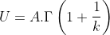
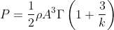

# MariaDB-GSL-UDF

This is just-the-beginning of my efforts to attach GNU Scientific Library (GSL)[[1]]#1 to the MariaDB[[2]]#2 database. 

I have started with the Special Functions which we need to use within SQL queries. Without this UDFs one has to download the data to the client and process with a basic scientific function (e.g. Gamma function or beta function).


## How to use the code

You need to:
- Compile the code
- Copy the library file to MariaDB plugin directory 
- Activate the functions with an SQL execution

The code is for
- MariaDB > 10.5
- GSL > 2.5
- I did not test on Windows

### Compile, install and test
Below first line will prepare the Makefile and the other two will install it.  
```
$ cmake CMakeList.txt
$ make
$ make install
```

Before any further you need to check the plugin directory. Above code has just used mariadb-config for detecting the plugin directory and copy the compiled library to that directory. But if you have setup a binary version of MariaDB (instead of compling yourself) default plugin directory might be different. Therefore, first learn the plugin directory with:

```
$ mariadb-config --plugindir
```
which returns /usr/lib/x86_64-linux-gnu/libmariadb3/plugin on Ubuntu 20.04 with MariaDB 10.5.7. To set this plugin directory you need to find and edit the default my.cnf config file with

```
$ locate my.cnf  # return /etc/mysql/my.cnf
$ sudo nano /etc/mysql/my.cnf
```

and add this to the end of the config file

```
[mysqld]
plugin_dir=/usr/lib/x86_64-linux-gnu/libmariadb3/plugin
```

Now, save, exit and restart mariadb server

```
$ sudo service mariadb restart
```

Thereafter, you are ready to install the new functions via
```
$ mysql
mysql> source MariaDB-GSL-UDF.sql
```

### Installation of binary release
Move library to your plugin directory and run the SQL command above (there is no binary release yet!)


## Basic Usage Example
In wind energy, the mean wind speed and mean power density of a location is calculated from Weibull distribution parameters with two formulas that include Gamma function[[3]](#1). A and k are the scale paramaters, respectively. ρ is the air density (standart 1.255 kg/m3).








Let's say, the scale parameter A is 8.1 m/s, the dimensionless shape parameter is 2.3 and we are observing a standart air density.  

```
SET @A=8.1;
SET @k=2.3;

SELECT 
	@A * Mgsl_sf_gamma(1+1/@k) AS U,
	0.5 * 1.255 * POW(@A,3) * Mgsl_sf_gamma(1+3/@k) AS P;

+------------------+--------------------+
| U                | P                  |
+------------------+--------------------+
| 7.17590910524094 | 390.09255248067166 |
+------------------+--------------------+
1 row in set (0.000 sec)
```

We get the result literaly in no-second! This is fast enough when you compare to downloading data and having this process locally. 

## License

This code is distributed under The GNU Affero General Public License. \
(c) Ferhat Bingöl, ÜSTÜN ENERGY ENGINEERING LLC, IZMIR, TURKEY \
WWW.USTUNENERGY.COM

## References

<a id="1">[1]</a>
https://www.gnu.org/software/gsl/ \
<a id="2">[2]</a> 
https://mariadb.org/ \
<a id="3">[3]</a> 
Ferhat Bingöl, "Comparison of Weibull Estimation Methods for Diverse Winds", Advances in Meteorology, vol. 2020, 11 pages, 2020. https://doi.org/10.1155/2020/3638423\

